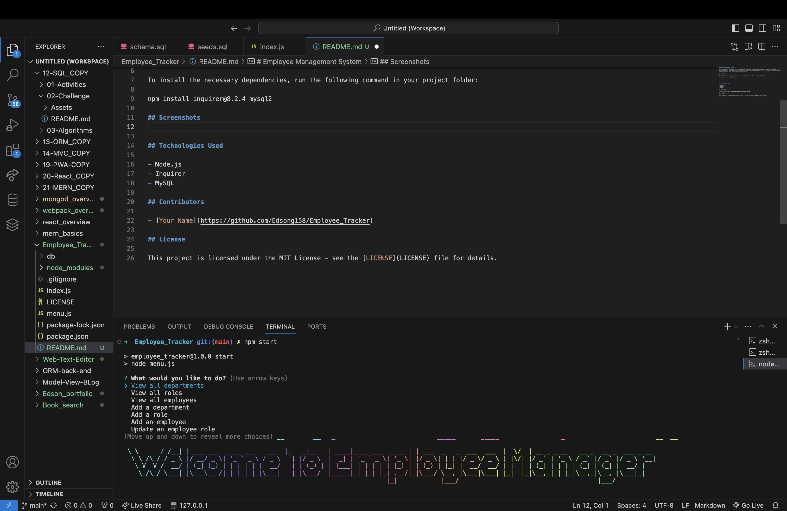

# Employee Management System

This command-line application is a simple Employee Management System built using Node.js, Inquirer, and MySQL. It allows users to manage a company's employee database by performing various operations such as viewing departments, roles, and employees, adding new departments, roles, and employees, updating employee roles, and quitting the application.

## Installation

To install the necessary dependencies, run the following command in your project folder:

npm install inquirer@8.2.4 mysql2

## Screenshots
()

## Technologies Used

- Node.js
- Inquirer
- MySQL

## Contributors

- [Your Name](https://github.com/Edsong158/Employee_Tracker)

## License

This project is licensed under the MIT License - see the [LICENSE](LICENSE) file for details.